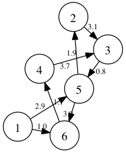

# GraphPath

経路探索

## Usage

```ruby
graph = GraphPath::Graph.new(1 => [[5, 2.9], [6, 1.0]],
                             2 => [[3, 3.1]],
                             3 => [[5, 0.8]],
                             4 => [[3, 3.7]],
                             5 => [[2, 1.9], [6, 3.0]],
                             6 => [[4, 1.1]]
                             )
```



```ruby
routes = graph.search(1, 3)
routes.found? #=> true
routes.path   #=> [1, 6, 4, 3]
```

## Options

* `:searcher`
  * GraphPath::Searcher::Dfs      - Depth First Search
  * GraphPath::Searcher::Bfs      - Breadth First Search
  * GraphPath::Searcher::Dijkstra - Dijkstra
  * GraphPath::Searcher::AStar    - A*

```ruby
graph.search(1, 3, searcher: GraphPath::Searcher::Dfs)
```

```ruby
graph.search(1, 3, searcher: GraphPath::Searcher::AStar) do |target, node|
  target - node # A* Heuristic calculate
end
```

## TODO

* 2点間の最短経路をしらべることしかできないので、色々機能追加する
* パフォーマンス

## Contributing

1. Fork it
2. Create your feature branch (`git checkout -b my-new-feature`)
3. Commit your changes (`git commit -am 'Add some feature'`)
4. Push to the branch (`git push origin my-new-feature`)
5. Create new Pull Request
